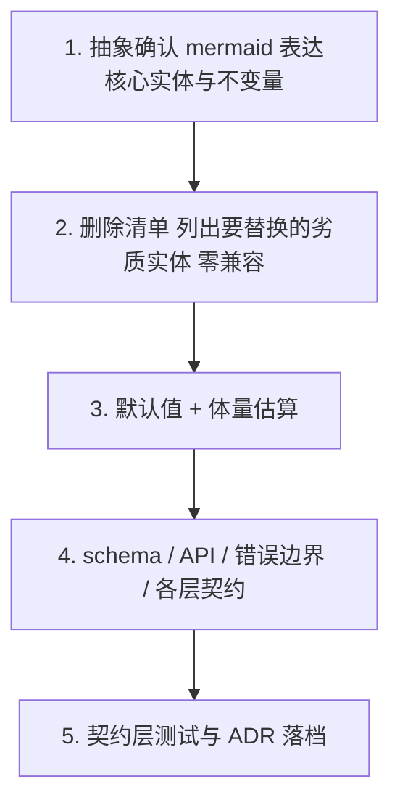

# Python 工程设计原则（Design Principles）

| 项 | 内容 |
| --- | --- |
| 文档定位 | 任意 Python 工程仓库的**架构与设计层**评审硬性依据 |
| 范围聚焦 | 只覆盖 Cursor agent 与人类工程师**默认容易做错的设计选择** |
| 不覆盖 | 通用 Python 编码习惯（PEP 8、类型注解、`with`、`pathlib`、`logging` 替代 `print`、测试金字塔…）— Cursor agent 默认即遵守，无须重复约束 |
| 不覆盖 | 项目特定决策（数据库、框架、领域模型、CI 工具链）— 写在各自的 `docs/<topic>-design.md` |
| 强制力 | 违反「核心准则」或命中「反模式」者 = 重写而非补丁 |
| 适用对象 | 人类工程师 + AI coding agent |

---

## 0. 适用范围

适用于：架构提案、模块拆分、数据建模、接口契约、跨切面能力（观测 / 安全 / 审计 / 限流 / 缓存）、重构方案。
不适用于：纯实现细节、单函数命名、格式化、测试组织（这些走 Cursor agent 默认 + 项目 lint/format 工具链）。

---

## 1. 设计者角色（人与 agent 共同遵守）

> 输入大多来自非架构师，描述局部、夹带场景偏见。设计者**不是字面执行者**。
> 这一节是本文件最反「agent 默认行为」的部分，必须始终内化。

1. **以资深架构师自居**：洞察用户真实诉求，主动**纠正与补全**有限输入，而非按字面 1:1 实现。
2. **反推上层抽象**：用户给出的常常只是局部触发点。问自己：是否暴露了一个本应通用的能力缺口？
   - 是 → 先做通用层，让该场景成为它的实例。
   - 否 → 给出明确证据，再做局部解。
3. **主动给出反对意见与替代方案**；不为顺从而妥协架构。
4. **一次提案回答所有同类问题**：不要等用户逐点提示才补齐设计。
5. **拒绝字面执行**：如果你的方案能逐字解释为「用户问 X 我做 X」，多半未达架构层级，**重写**。

---

## 2. 核心准则

### 2.1 抽象与架构

1. **通用性 > 场景**：先抽象统一模型，让每种场景成为它的实例；不为单一场景新增并行模块 / 表 / API。
2. **行为一致**：同一抽象在不同上下文下语义、API、数据形态一致；扩展通过参数 / 配置 / 多态，而非新建分叉模型。
3. **关注点分离 + 依赖注入**：业务逻辑、I/O、配置、横切关注点彼此解耦；硬绑定通过依赖注入消除。
4. **组合优于继承**：默认用组合 + `Protocol` / `ABC` 表达接口契约；继承仅用于真正的 is-a。
5. **跨切面能力管道化**：观测、安全、审计、限流、缓存等横切关注点 → **单一接口 + 可插拔后端**；核心模块**不做条件分支扩展**（不要 `if mode==…` / `if env==…` 在主流程里嵌横切逻辑）。

### 2.2 数据与边界

6. **schema 演化按维度扩展**：新维度通过受控扩展点（结构化字段、版本化 schema、独立子表）；**禁止**「加一列」当扩展能力的方案。
7. **外部边界类型化校验**：所有外部输入（HTTP / CLI / 文件 / 配置 / 环境变量 / 第三方 API 返回）使用类型化 schema（Pydantic / dataclass + validator）；**内部信任已校验**，不重复校验。

### 2.3 错误与可观测（架构层）

8. **错误显式分层**：**业务路径不吞错**；捕获即处理或带上下文重抛；自定义异常类继承结构清晰，跨层错误用专用异常类型而非透传底层细节。
9. **失败可观测**：失败路径必须留下结构化诊断（结构化日志 / 异常上下文 / **相关性 ID** 串起一次业务请求的全链路）。

### 2.4 默认与配置

10. **零配置可用**：组件默认值能在**预期常见负载**下工作；新建模块的「能跑」不依赖任何强制前置配置。
11. **配置只为非默认场景**：任何「必须先配置 N 项才能运行」的设计 = 重写。

---

## 3. 反模式（架构评审一票否决）

> 本节只列**架构 / 设计层**反模式（Cursor agent 默认就不会犯的代码风格反模式不在此处）。命中任意一条 → 方案打回，不接受「先这样再说」。

- **加列扩展**：把「在 X 表 / 类 / 函数加一参数」当作扩展能力的方案。
- **场景独立栈**：给某类场景单独建表 / 单独 API / 单独日志通道。
- **兼容层先行**：用「先做兼容层」当作不替换劣质设计的理由。
- **核心模块横切分支**：在主流程里写 `if env==…` / `if mode==…` 表达跨切面能力。
- **抽象与外观错位**：UI / API 暴露的概念多于或少于底层模型；或多个层各持一套独立模型。
- **大 JSON 当主索引入口**：把可变结构当成查询主路径而非 free-form attrs。
- **业务路径吞错**：catch-all 后无降级、无相关性 ID、无重抛上下文。
- **强配置依赖**：「必须先配置 N 项才能跑」的开发体验。
- **字面执行**：以「按用户字面诉求做最小补丁」为默认动作，未做架构反推。

---

## 4. 设计交付物 checklist（提案前自查）

- [ ] 核心实体与**不变量**写明（什么永远成立）
- [ ] 该抽象在**所有同类用例**上统一表达，并给出**举例验证**
- [ ] 写入 / 查询 / **扩展点切换** 三条路径都成立
- [ ] 错误兜底（错误必留 / 慢必留 / 重试边界 / 降级方案 / 相关性 ID）
- [ ] **删除清单**：要替换的旧实体，**零兼容层**
- [ ] 各层契约（UI / API / SDK / 内部模块）对齐到同一模型
- [ ] 风险与边界（cardinality、写放大、崩溃恢复、并发安全、时钟漂移）
- [ ] 分阶段、可独立合并的实施步骤（每步可发独立 PR）
- [ ] 「零配置可工作」演练通过

---

## 5. 推荐工作流

任一步未完成就跳到下一步 = 自动失败：
- 抽象未通过 → 重写，不要进 schema。
- 删除清单缺失 → 默认就会出现兼容层债务，重写。

---

## 6. 自更新与传播

- 任一方案落地后：
  - 同步更新对应的 `docs/<topic>-design.md`；被推翻的旧章节标记 `superseded`。
  - 在本文件 §「修订记录」追加一行。
  - 发现新**架构层**反模式 → 补到 §3（代码风格反模式不在本文件范围内）。
  - 同步刷新 [`.cursor/rules/design-principles.mdc`](../.cursor/rules/design-principles.mdc) 摘要。

---

## 7. 修订记录

| 版本 | 日期 | 摘要 |
| --- | --- | --- |
| 0.1 | 2026-04-29 | 初稿，含项目特定内容 |
| 0.2 | 2026-04-29 | 通用化为 Python 工程原则，删除项目特定术语 |
| 0.3 | 2026-04-29 | **聚焦审计**：删除与 Cursor agent 默认行为重复的通用 Python 编码习惯（≈30% 体量），删除「函数 ≤ 50 行」「实体 ≤ 5 个」等武断数字；本文件仅保留**架构层可验证**准则与反模式 |
| 0.4 | 2026-04-29 | 删除高吞吐写入配额 / 直写 OLTP 反模式及相关 checklist、工作流失败条件中的体量门禁表述（由项目级设计文档承载） |
